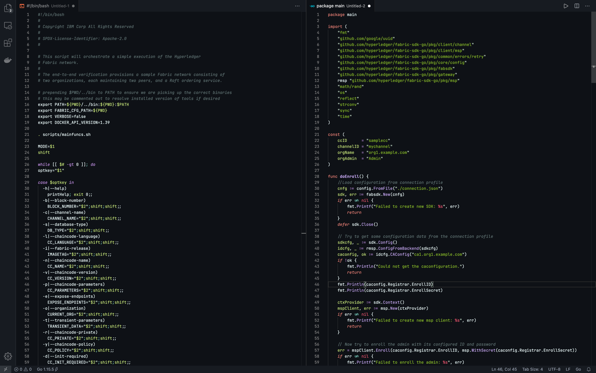

# GitHub Dark
A Visual Studio Code theme for the late night coders out there. Fine-tuned for those of us who like the brand new Github Dark theme.

## Screenshots

## Supported Languages
- Markdown
- Go

a lot more coming...

## Installation
1. Install [Visual Studio Code](https://code.visualstudio.com/)
2. Launch Visual Studio Code
3. Choose Extensions from menu
4. Search for Github Dark
5. Install it
6. Reload Visual Studio Code
7. From the menu bar click: Code > Preferences > Color Theme > Github Dark

## Misc
This is my first foray into creating a theme, so if you see something amiss, please feel free to file an issue! I'm sure there are things I missed.

This palette was inspired in part by the brand new GitHub Dark Theme